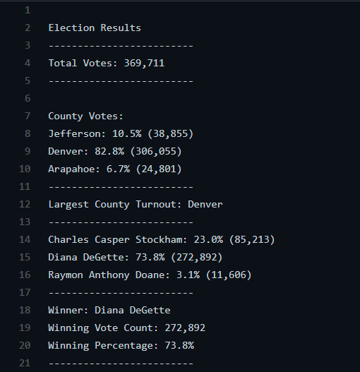
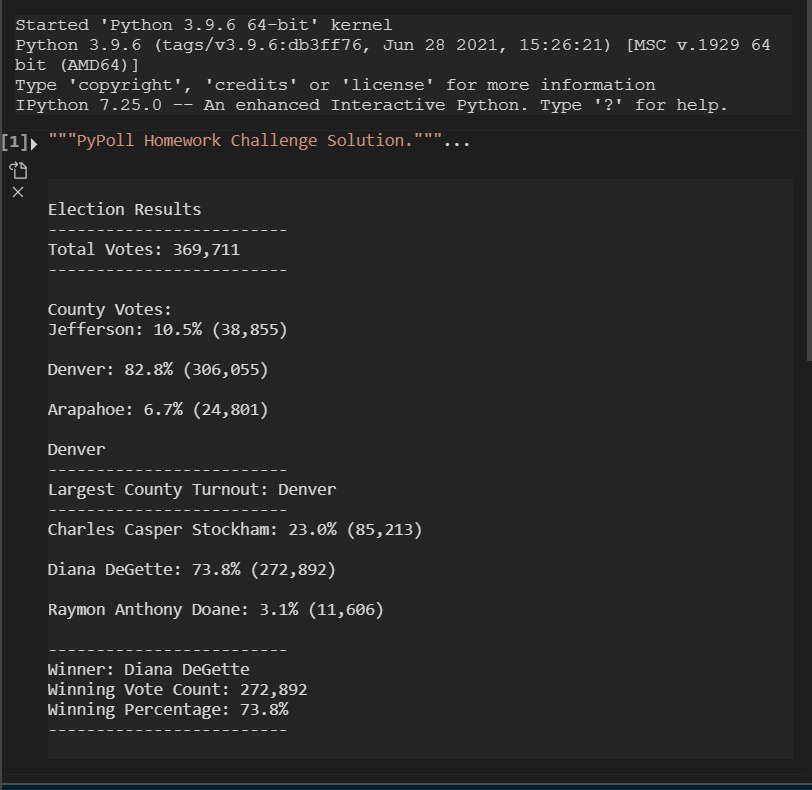
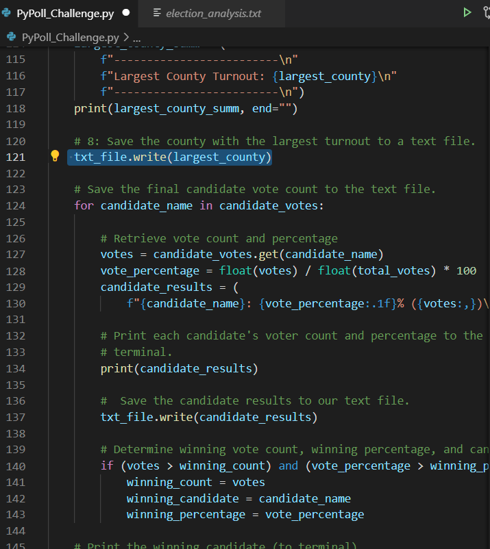
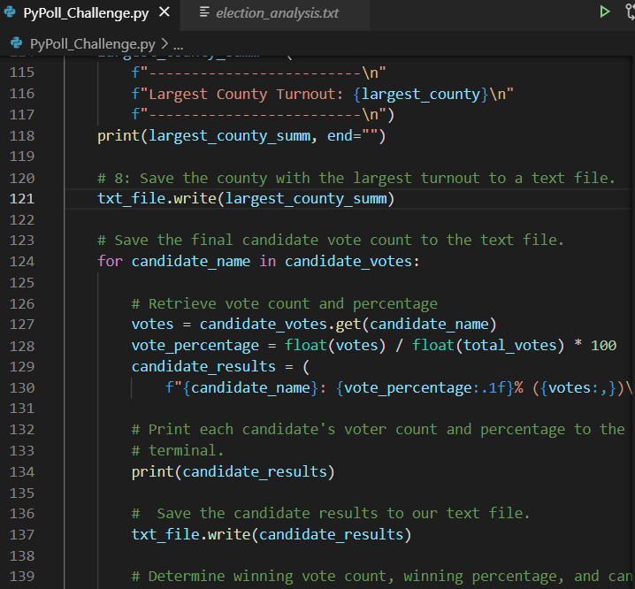

# PyPoll: Pythons on a Poll

## Overview of Election Audit
This election audit analysis is a test on our skills in Python to execute code that can organize, format, display, and save a final summary of the findings in a real life example of vote counting. The code must transform from a list of commands to a full fledged final data layout of the results in a text file ready for analysis.

## Election-Audit Results
* How many votes were cast in this congressional election?
    * There were a total of *369,711* votes casted across all recorded counties.
* Provide a breakdown of the number of votes and the percentage of total votes for each county in the precinct.
    * __Jefferson County__ achieved *10.5%* of the total votes at *38,855*.
    * __Denver County__ achieved *82.8%* of the total votes at *306,055*.
    * __Arapahoe County__ achieved *6.7%* of the total votes at *24,801*.
* Which county had the largest number of votes?
    * __Denver County__ by far had both the largest ammount of votes and the highest voter percentage of toal votes from all 3 counties.
* Provide a breakdown of the number of votes and the percentage of the total votes each candidate received.
    * __Charles Casper Stockham__ achieved *23%* of the total votes at *85,213*.
    * __Diana DeGette__ achieved *73.8%* of the total votes at *272,892*.
    * __Raymon Anthony Doane__ achieved *3.1%* of the total votes at *11,606*.
* Which candidate won the election, what was their vote count, and what was their percentage of the total votes?
    * __Diane DeGette__ convincingly won the election by taking *73.8%* of all votes from all three counties, equaling a whopping *272,892*. 

## Election Audit Summary
With the results of this test regarding sorting through, tallying all the data provided, and producing an easy to read final results document within seconds, it should prove that using the developed code would provide a more *efficient and accurate* system to count the votes.

Though VBA is quite useful, the usage of Python has a simpler code that can run directly from the Python file. And with the use of VS Code, it also provides an easy place to replace any code for any future elections, even if we add more candidates and counties. The baseline is set for numerous future elections. 

If the need arises to add more counties, it can be done by simply adding another county to the list; the same goes for any new candidates. As all of the calculations for percentage and counting is done automatically and doesn't matter who or where the votes are from, as long as they are labeled consistently with the existing columns.

### Troubles I Had With Python
I had a few issues pertaining to the final text file of the *Election Results*. My initial run of the code had an extra "Denver" spliced in right in front of the formatting for the "Largest County Turnout".

It turns out that I had implemented the incorrect text file write in the code and I managed to fix it by deleting the incorrect one and finding out where I went wrong and what changes it made. Eventually, I figured it out and I figured out the logic of it.

